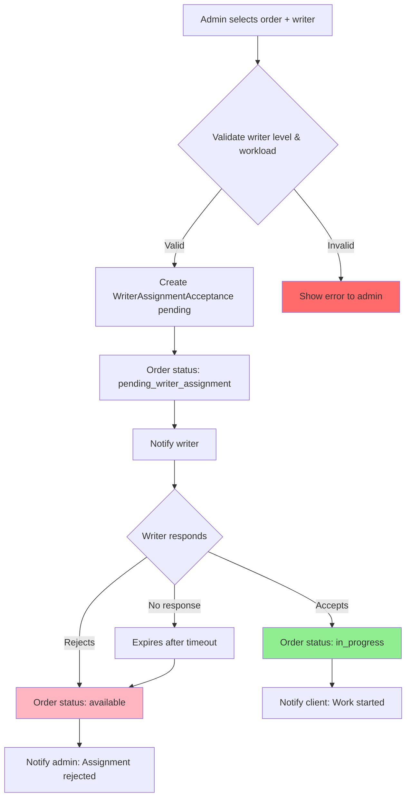
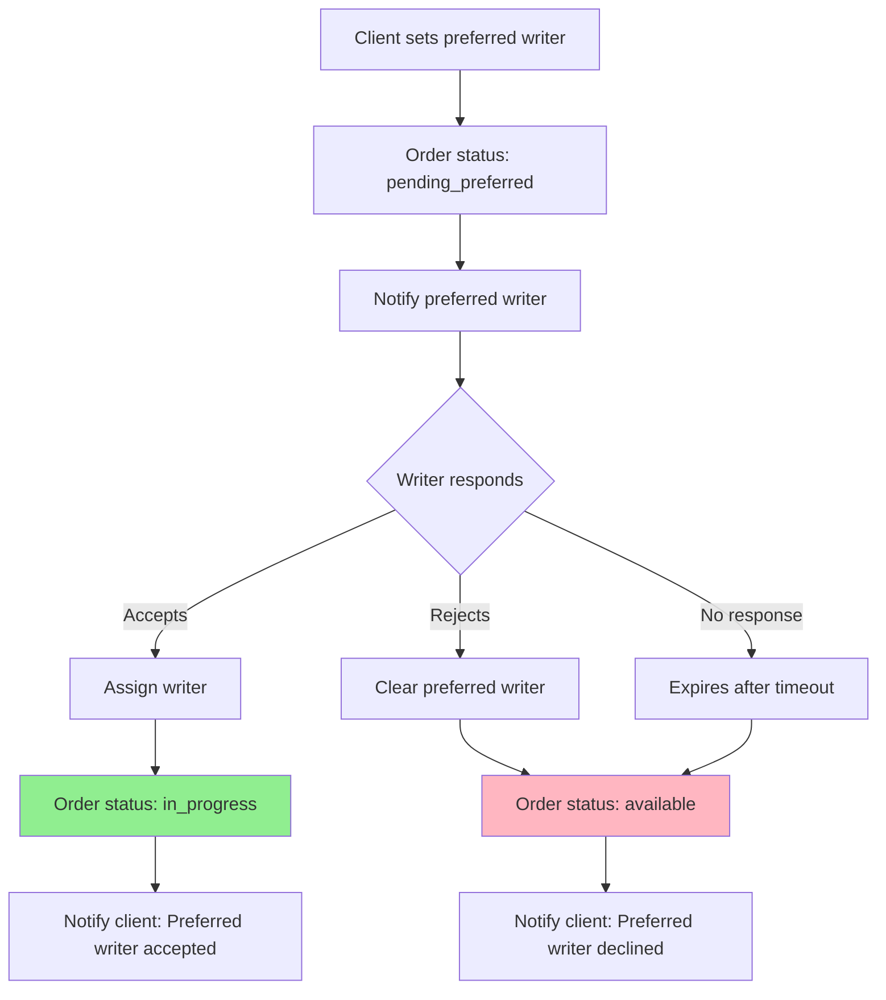
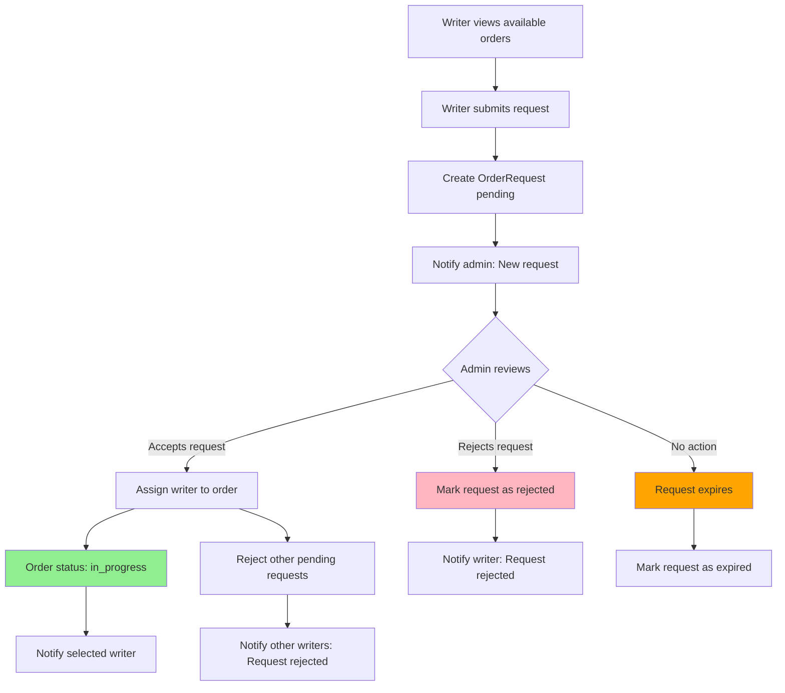
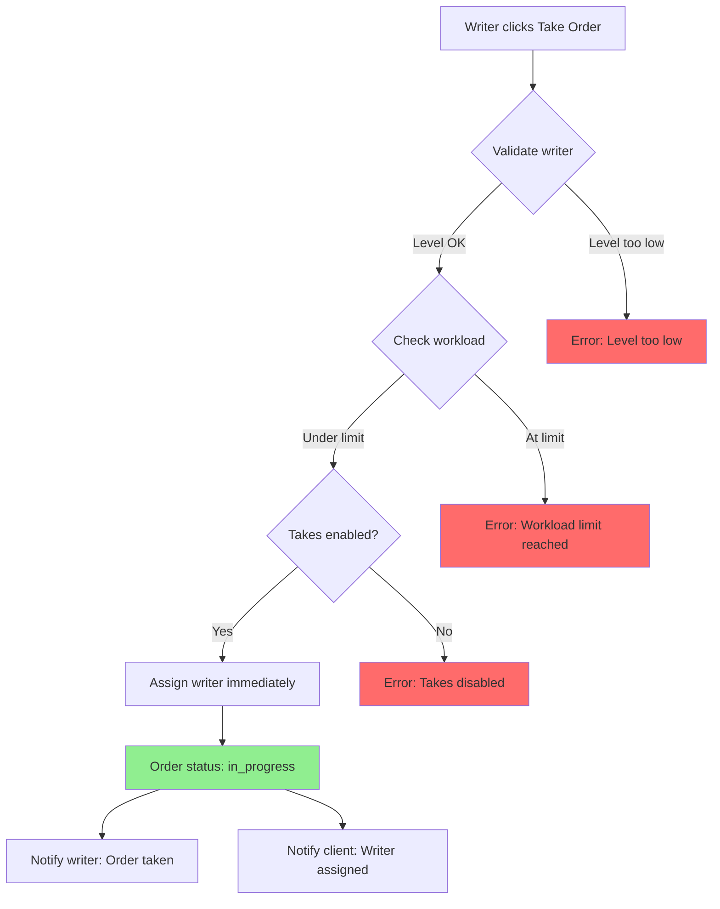
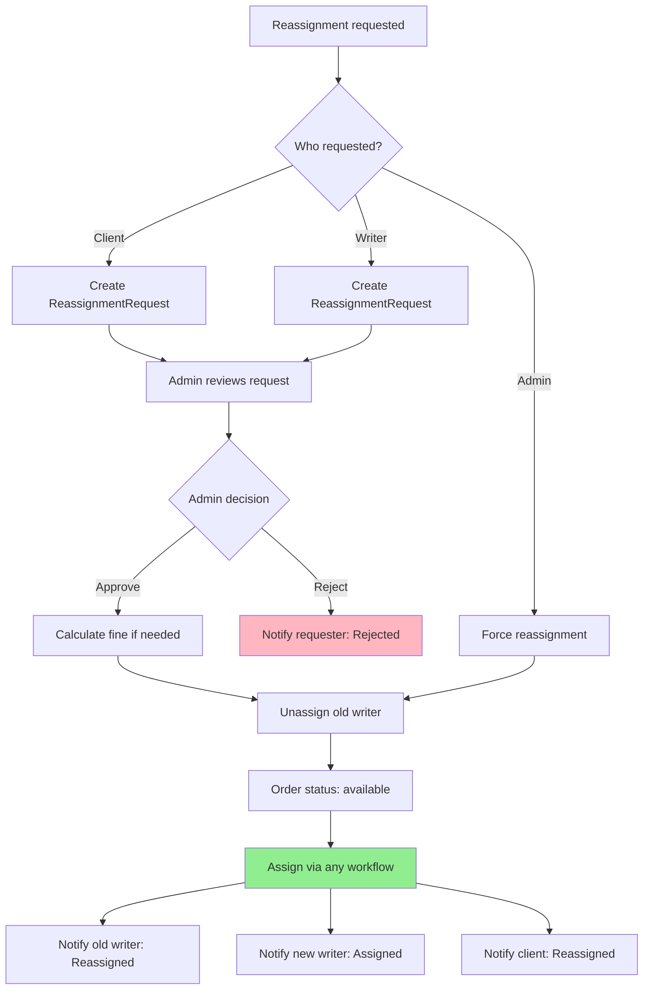
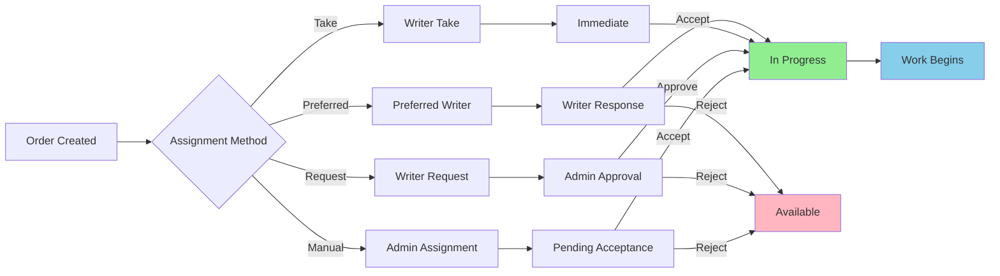

# Order Assignment Workflows

## Overview

The order assignment system supports multiple workflows for assigning writers to orders. Each workflow has specific use cases, validation rules, and status transitions.

## Assignment Workflows

### 1. Manual Assignment (Admin/Support)

**Who**: Admin, Superadmin, Support  
**When**: Direct assignment by staff  
**Status Flow**: `available/paid` → `pending_writer_assignment` → `in_progress` (after acceptance)

#### Process:
1. Admin selects order and writer
2. System validates:
   - Writer level matches order requirements
   - Writer workload limits (unless admin override)
   - Order is in assignable status
3. Order status → `pending_writer_assignment`
4. `WriterAssignmentAcceptance` record created (status: `pending`)
5. Writer receives notification
6. Writer accepts/rejects:
   - **Accept**: Order → `in_progress`
   - **Reject**: Order → `available` (unassigned)

#### Features:
- ✅ Admin override for workload limits
- ✅ Admin override for writer level requirements
- ✅ Custom writer payment amount
- ✅ Reassignment support (marks old acceptance as rejected)
- ✅ Full audit logging

#### Code Location:
- Service: `backend/orders/services/assignment.py` → `OrderAssignmentService.assign_writer()`
- ViewSet: `backend/orders/views/writer_assignment_acceptance.py`
- Model: `backend/orders/models.py` → `WriterAssignmentAcceptance`

---

### 2. Writer Request Workflow

**Who**: Writers request, Admin approves  
**When**: Writer sees available order and requests it  
**Status Flow**: `available` → `in_progress` (after admin approval)

#### Process:
1. Writer views available orders
2. Writer submits request (creates `OrderRequest` with status: `pending`)
3. Admin reviews requests
4. Admin accepts one request:
   - Selected request → `accepted`
   - Other requests → `rejected`
   - Order assigned to selected writer
   - Order status → `in_progress` (directly, no acceptance needed)
5. Writer and client notified

#### Features:
- ✅ Multiple writers can request same order
- ✅ Admin selects best writer
- ✅ Automatic rejection of other requests
- ✅ Request expiration (15 minutes default)
- ✅ Request withdrawal by writer

#### Code Location:
- Service: `backend/orders/services/order_request_service.py` → `OrderRequestService`
- Model: `backend/orders/models.py` → `OrderRequest`

---

### 3. Writer Take Workflow

**Who**: Writers  
**When**: Writer directly takes an available order (if enabled)  
**Status Flow**: `available` → `in_progress` (immediate)

#### Process:
1. Writer views available orders
2. Writer clicks "Take Order"
3. System validates:
   - Writer level matches order
   - Writer hasn't reached take limit
   - Takes are enabled for writer
4. Order immediately assigned
5. Order status → `in_progress`
6. Writer and client notified

#### Features:
- ✅ Immediate assignment (no admin approval)
- ✅ Take limit enforcement
- ✅ Can be disabled per writer
- ✅ Level validation

#### Code Location:
- ViewSet: `backend/writer_management/views.py` → `WriterOrderTakeViewSet`
- Model: `backend/writer_management/models/requests.py` → `WriterOrderTake`

---

### 4. Preferred Writer Workflow

**Who**: Client sets preferred writer, Writer accepts/rejects  
**When**: Client selects a preferred writer during order creation  
**Status Flow**: `paid/available` → `pending_preferred` → `in_progress` (after acceptance)

#### Process:
1. Client creates order and selects preferred writer
2. Order status → `pending_preferred`
3. Preferred writer receives notification
4. Writer accepts/rejects:
   - **Accept**: Order → `in_progress`, writer assigned
   - **Reject**: Order → `available`, preferred writer cleared
5. Client notified of writer's decision

#### Features:
- ✅ Client preference honored
- ✅ Writer can decline
- ✅ Automatic fallback to available pool
- ✅ Additional fee for preferred writer
- ✅ Response expiration

#### Code Location:
- Service: `backend/orders/services/preferred_writer_service.py` → `PreferredWriterService`
- Service: `backend/orders/services/preferred_writer_response.py` → `PreferredWriterResponseService`
- ViewSet: `backend/orders/views/preferred_writer_response.py`
- Model: `backend/orders/models.py` → `PreferredWriterResponse`

---

### 5. Reassignment Workflow

**Who**: Client, Writer, or Admin initiates  
**When**: Need to change assigned writer  
**Status Flow**: Current status → `available` → (reassign via any workflow)

#### Process:
1. Reassignment request created (`ReassignmentRequest`)
2. Admin reviews request
3. Admin resolves:
   - Assigns new writer (via manual assignment)
   - Or returns to available pool
4. Old writer unassigned
5. Fine may be applied (if writer-initiated near deadline)

#### Features:
- ✅ Client-initiated reassignment
- ✅ Writer-initiated reassignment
- ✅ Admin force reassignment
- ✅ Fine calculation for late reassignments
- ✅ Preferred writer option in reassignment

#### Code Location:
- Service: `backend/orders/services/reassignment.py` → `OrderReassignmentService`
- Model: `backend/orders/models.py` → `ReassignmentRequest`

---

## Status Transitions

### Assignment-Related Statuses:

1. **`available`**: Order is available for assignment
2. **`pending_writer_assignment`**: Assigned by admin, waiting for writer acceptance
3. **`pending_preferred`**: Preferred writer set, waiting for writer response
4. **`in_progress`**: Writer assigned and accepted, work in progress

### Transition Rules:

```
available → pending_writer_assignment (manual assignment)
available → pending_preferred (preferred writer set)
available → in_progress (writer take/request approved)

pending_writer_assignment → in_progress (writer accepts)
pending_writer_assignment → available (writer rejects)

pending_preferred → in_progress (preferred writer accepts)
pending_preferred → available (preferred writer rejects)
```

---

## Validation Rules

### Writer Level Validation
- Writer level must match or exceed order requirements
- Admin can override level requirements

### Workload Limits
- Writers have max concurrent orders (from `WriterLevel`)
- Counts: `in_progress`, `on_hold`, `revision_requested`, `under_editing`
- Admin can override workload limits

### Request Limits
- Writers have max pending requests (from `WriterLevel` or `WriterConfig`)
- Default: 5 pending requests
- Admin can override when assigning from request

### Order Status Validation
- Order must be in assignable status (`available`, `paid`)
- Cannot assign to orders in final states (`completed`, `cancelled`, `closed`)

---

## Notification Flow

### Manual Assignment:
1. Writer: "New Order Assigned - Please accept or reject"
2. Client: "Writer Assigned - Waiting for confirmation"

### Writer Request:
1. Admin: "New request for Order #X"
2. Writer (on approval): "Your request was approved"
3. Other writers: "Your request was rejected"

### Preferred Writer:
1. Writer: "You are the preferred writer for Order #X"
2. Client (on accept): "Preferred writer accepted"
3. Client (on reject): "Preferred writer declined"

### Reassignment:
1. Old writer: "Order #X has been reassigned"
2. New writer: "New Order Assigned"
3. Client: "Writer Reassigned"

---

## Frontend Components

### Admin Assignment Modal
- **Location**: `frontend/src/components/order/OrderActionModal.vue`
- **Features**:
  - Writer selection with workload display
  - Custom payment amount
  - Reason/notes field
  - Workload override option

### Writer Order Queue
- **Location**: `frontend/src/views/writers/OrderQueue.vue`
- **Features**:
  - Available orders list
  - Request order button
  - Take order button (if enabled)
  - Pending assignments tab
  - Pending preferred tab

### Assignment Acceptance UI
- **Location**: `frontend/src/views/writers/OrderQueue.vue` (Pending Assignments tab)
- **Features**:
  - Accept/Reject buttons
  - Reason field (optional)
  - Order details display

---

## API Endpoints

### Assignment
- `POST /api/v1/orders/orders/{id}/action/` - Execute assignment action
- `GET /api/v1/admin-management/writer-assignment/available-writers/` - Get available writers
- `GET /api/v1/admin-management/writer-assignment/{writer_id}/workload/` - Get writer workload

### Assignment Acceptance
- `GET /api/v1/orders/writer-assignment-acceptances/pending/` - Get pending assignments
- `POST /api/v1/orders/writer-assignment-acceptances/{id}/accept/` - Accept assignment
- `POST /api/v1/orders/writer-assignment-acceptances/{id}/reject/` - Reject assignment

### Preferred Writer
- `GET /api/v1/orders/preferred-writer-responses/pending/` - Get pending preferred orders
- `POST /api/v1/orders/preferred-writer-responses/{order_id}/accept/` - Accept preferred assignment
- `POST /api/v1/orders/preferred-writer-responses/{order_id}/reject/` - Reject preferred assignment

### Writer Requests
- `POST /api/v1/writer-management/writer-order-requests/` - Create request
- `POST /api/v1/writer-management/writer-order-requests/{id}/assign/` - Admin assign from request
- `GET /api/v1/writer-management/writer-order-requests/` - List requests

### Writer Takes
- `POST /api/v1/writer-management/writer-order-takes/` - Take order directly

---

## Current Implementation Status

### ✅ Fully Implemented:
1. ✅ Manual Assignment (Admin/Support)
2. ✅ Writer Request Workflow
3. ✅ Writer Take Workflow
4. ✅ Preferred Writer Workflow
5. ✅ Reassignment Workflow
6. ✅ Assignment Acceptance Flow
7. ✅ Preferred Writer Acceptance Flow
8. ✅ Validation Rules (level, workload, limits)
9. ✅ Admin Override Capabilities
10. ✅ Notification System
11. ✅ Frontend Components
12. ✅ API Endpoints

### ✅ Implemented Enhancements:

1. **Auto-Assignment** ✅
   - **Status**: Fully Implemented
   - Automatic assignment based on:
     - Writer expertise (subject, paper type) ✅
     - Writer rating (30% weight) ✅
     - Writer availability ✅
     - Workload balancing (25% weight) ✅
   - **API**: `POST /api/v1/orders/orders/{id}/auto-assign/`
   - **Bulk API**: `POST /api/v1/orders/orders/bulk-auto-assign/`
   - **Service**: `backend/orders/services/auto_assignment_service.py`

2. **Assignment Queue** ✅
   - **Status**: Fully Implemented
   - Priority queue based on:
     - Writer rating (30% weight) ✅
     - Writer response time (25% weight) ✅
     - Writer success rate (25% weight) ✅
     - Order urgency (20% weight) ✅
   - **Service**: `backend/orders/services/assignment_queue_service.py`
   - Methods: `get_prioritized_requests_for_order()`, `assign_from_queue()`

3. **Bulk Assignment** ✅
   - **Status**: Fully Implemented
   - Assign multiple orders to writers ✅
   - Three distribution strategies:
     - **Balanced**: Workload-aware distribution ✅
     - **Round-Robin**: Even distribution ✅
     - **Best-Match**: Auto-assignment per order ✅
   - **API**: `POST /api/v1/orders/orders/bulk-assign/`
   - **Service**: `backend/orders/services/bulk_assignment_service.py`

### ✅ Completed Enhancements:

4. **Assignment Analytics** ✅
   - **Status**: Fully Implemented
   - Dashboard showing:
     - Assignment success rates ✅
     - Average time to acceptance ✅
     - Rejection reasons tracking ✅
     - Writer performance metrics ✅
     - Assignment trends over time ✅
   - **API**: `GET /api/v1/orders/assignment-analytics/dashboard/`
   - **Service**: `backend/orders/services/assignment_analytics_service.py`

5. **Smart Matching** ✅
   - **Status**: Fully Implemented
   - Intelligent writer-order matching:
     - Past performance on similar orders ✅
     - Subject expertise scoring ✅
     - Paper type experience matching ✅
     - Academic level matching ✅
     - Multi-factor scoring (6 factors) ✅
   - **API**: `GET /api/v1/orders/orders/{id}/smart-match/`
   - **Service**: `backend/orders/services/smart_matching_service.py`

---

## Workflow Diagrams

### Manual Assignment Flow:


### Preferred Writer Flow:


### Writer Request Flow:


### Writer Take Flow:


### Reassignment Flow:


### Complete Assignment Workflow Overview:


---

## Best Practices

1. **Always validate** before assignment:
   - Writer level
   - Workload limits
   - Order status

2. **Use appropriate workflow**:
   - Manual: For specific writer selection
   - Request: For writer-driven assignment
   - Preferred: For client preference
   - Take: For immediate assignment (if enabled)

3. **Handle rejections gracefully**:
   - Return order to available pool
   - Notify relevant parties
   - Log rejection reason

4. **Respect admin overrides**:
   - Allow workload limit overrides
   - Allow level requirement overrides
   - Document override reasons

5. **Maintain audit trail**:
   - Log all assignments
   - Track acceptance/rejection
   - Record reassignments

---

## Testing

### Test Files:
- `backend/orders/tests/test_order_workflows.py` - Assignment workflow tests
- `backend/tests/test_integration_workflows.py` - Integration tests

### Test Coverage:
- ✅ Manual assignment
- ✅ Writer request flow
- ✅ Assignment acceptance
- ✅ Preferred writer flow
- ✅ Reassignment
- ✅ Validation rules
- ✅ Admin overrides

---

## Summary

The order assignment system provides **5 distinct workflows** for assigning writers to orders:

1. **Manual Assignment** - Admin-driven with acceptance flow
2. **Writer Requests** - Writer-driven with admin approval
3. **Writer Takes** - Immediate writer assignment
4. **Preferred Writer** - Client preference with writer acceptance
5. **Reassignment** - Changing assigned writer

All workflows are **fully implemented** with:
- ✅ Comprehensive validation
- ✅ Status transition management
- ✅ Notification system
- ✅ Frontend components
- ✅ API endpoints
- ✅ Audit logging

The system is **production-ready** and supports all common assignment scenarios.

