# Architecture Reference

> Diagrams and flow documentation for the Writing System Platform.
> All diagrams use [Mermaid](https://mermaid.js.org/) — rendered natively on GitHub/GitLab.

---

## Table of Contents

1. [System Overview](#system-overview)
2. [Multi-Tenant Portal Architecture](#multi-tenant-portal-architecture)
3. [Frontend Surface Routing](#frontend-surface-routing)
4. [Order Lifecycle](#order-lifecycle)
5. [Writer Assignment Flow](#writer-assignment-flow)
6. [Payment & Wallet Pipeline](#payment--wallet-pipeline)
7. [Compensation Event Pipeline](#compensation-event-pipeline)
8. [Notification Pipeline](#notification-pipeline)
9. [Authentication Flow](#authentication-flow)
10. [Vetting & Application Pipeline](#vetting--application-pipeline)
11. [Dispute Resolution Flow](#dispute-resolution-flow)
12. [Background Task Architecture](#background-task-architecture)

---

## System Overview

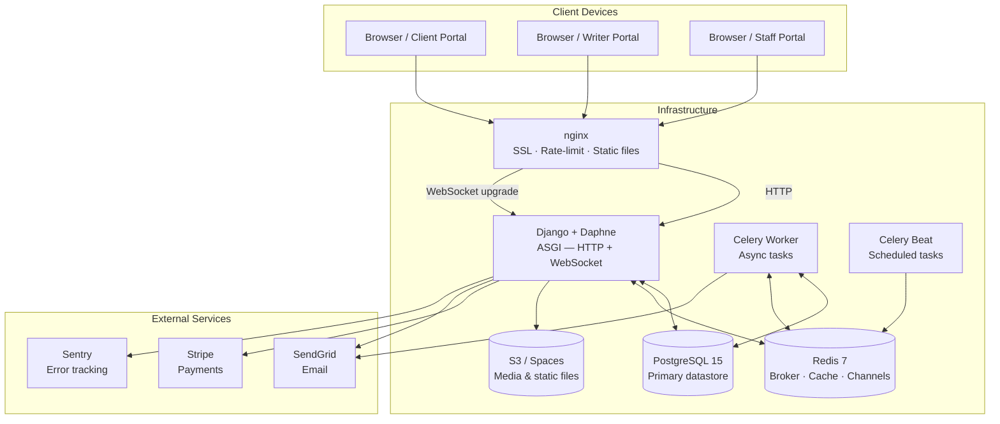

---

## Multi-Tenant Portal Architecture

Each domain resolves to a surface (client / writer / staff) via middleware before any view logic runs.

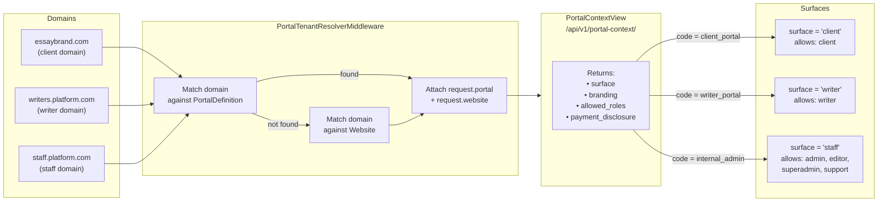

---

## Frontend Surface Routing

```mermaid
flowchart TD
    Start([App boot]) --> Init["portalContextStore.init()\nfetch /portal-context/"]
    Init --> Surface{surface?}

    Surface -->|client| CRoutes["Register /client/* routes only\nallowed roles: client"]
    Surface -->|writer| WRoutes["Register /writer/* routes only\nallowed roles: writer"]
    Surface -->|staff| SRoutes["Register /admin/* routes only\nallowed roles: admin · superadmin · editor · support"]
    Surface -->|error / unknown| Err[Error page\n503 — domain not configured]

    CRoutes --> Guard
    WRoutes --> Guard
    SRoutes --> Guard

    Guard["router.beforeEach\n1. Auth check\n2. Role check"]

    Guard -->|pass| View[Render view]
    Guard -->|unauthenticated| Login[/login for this surface]
    Guard -->|wrong role| Forbidden[403 page]
```

---

## Order Lifecycle

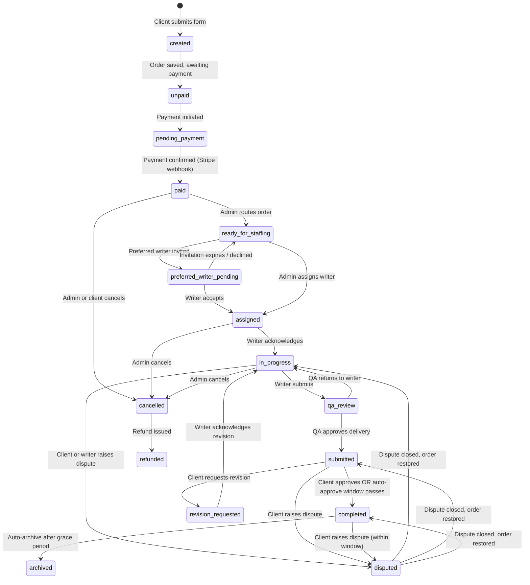

---

## Writer Assignment Flow

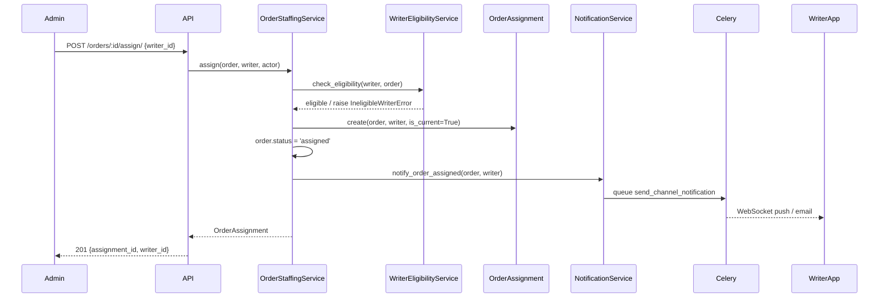

---

## Payment & Wallet Pipeline

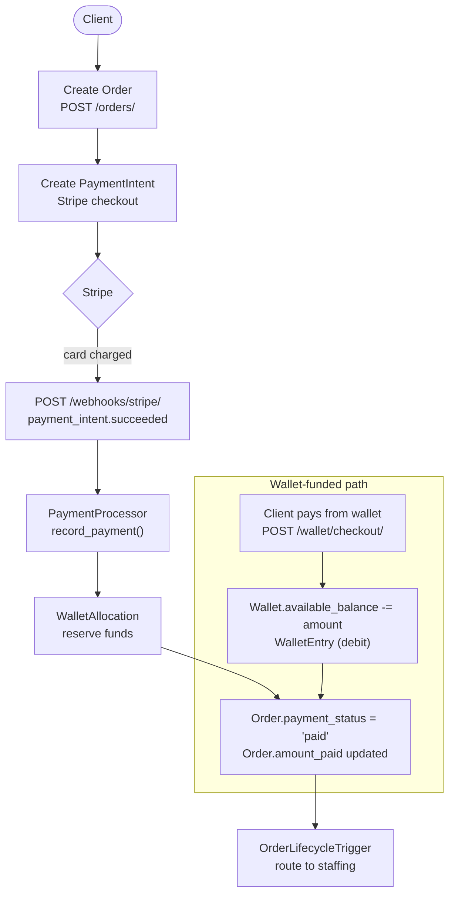

---

## Compensation Event Pipeline

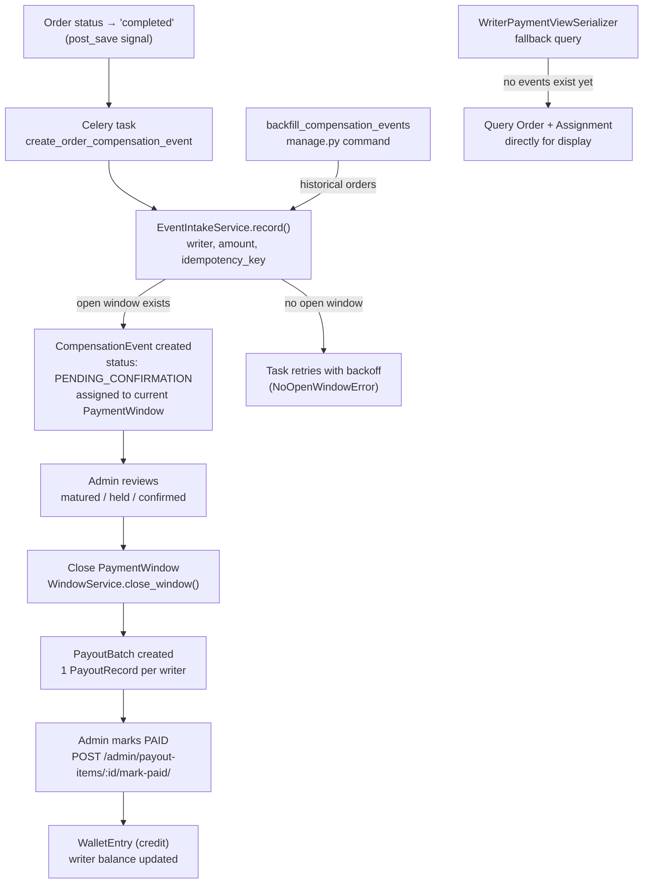

---

## Notification Pipeline

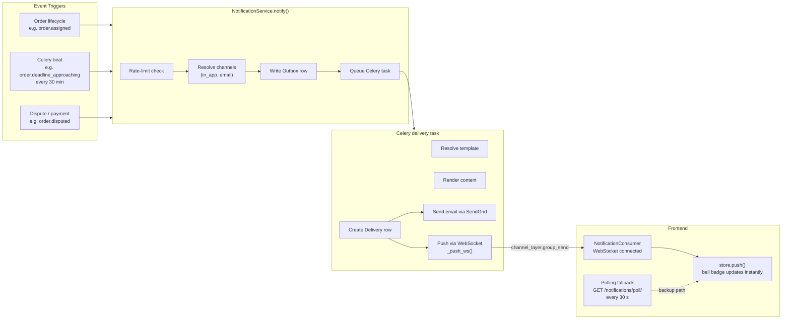

---

## Authentication Flow

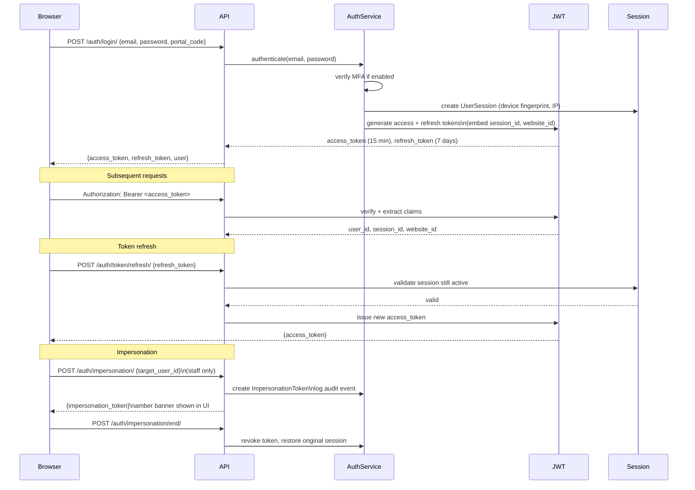

---

## Vetting & Application Pipeline

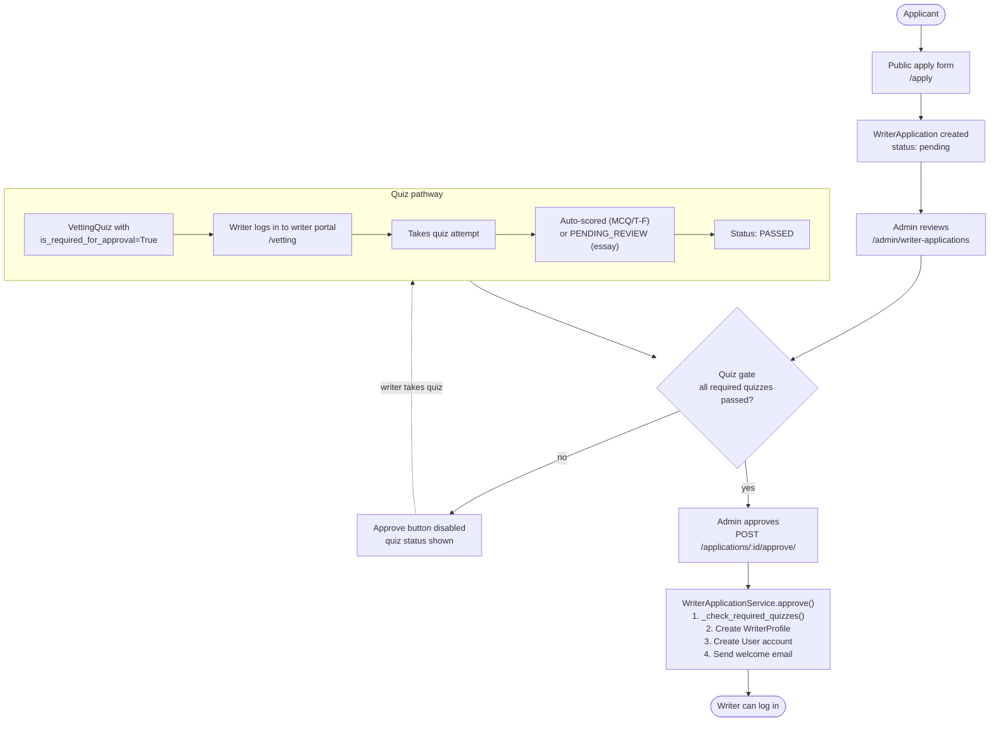

---

## Dispute Resolution Flow

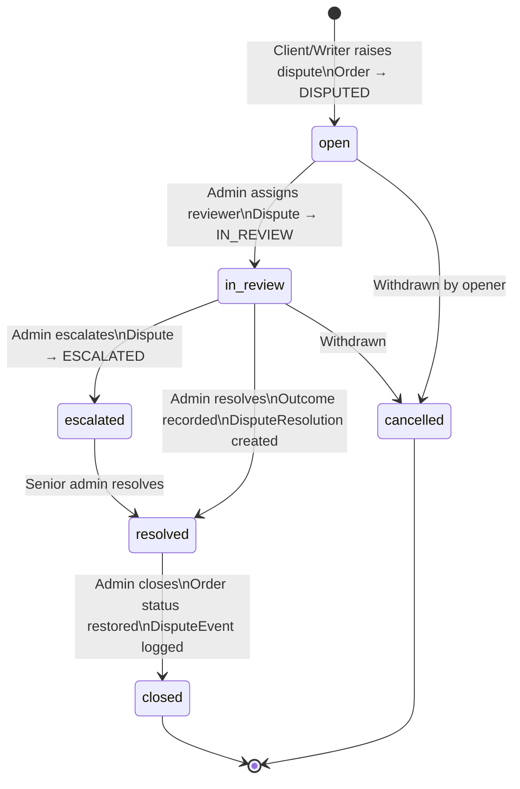

---

## Background Task Architecture

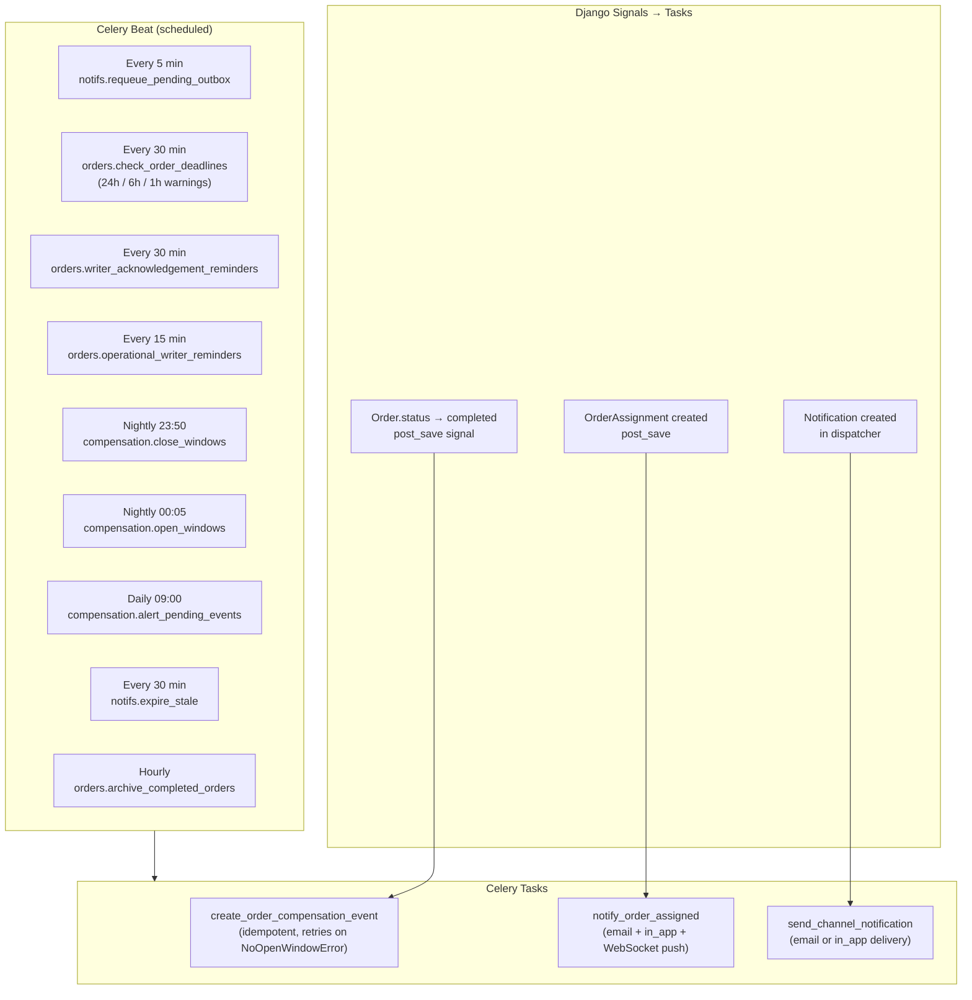

---

## Data Model Summary

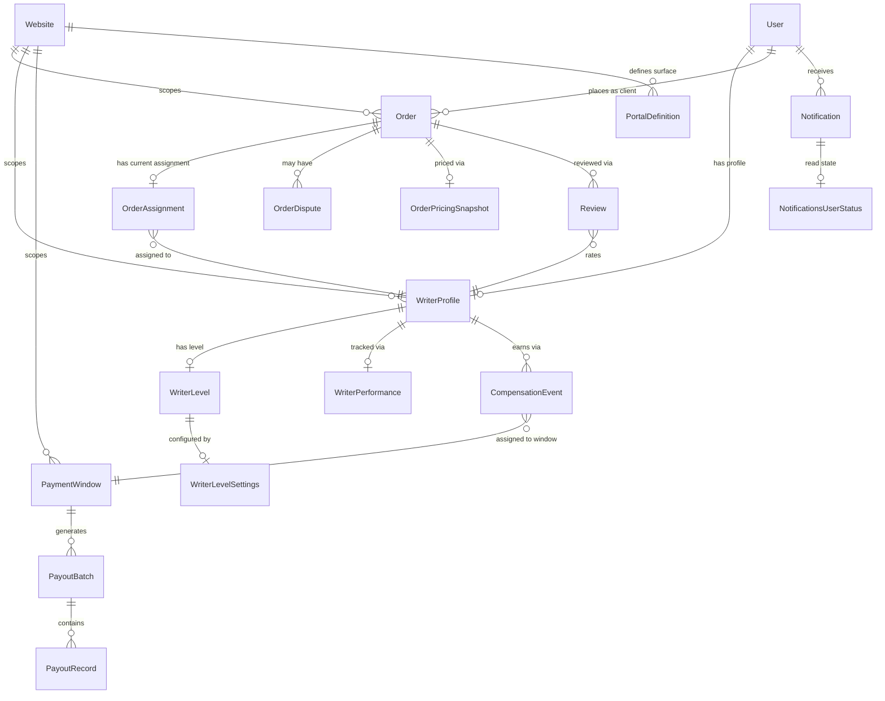
