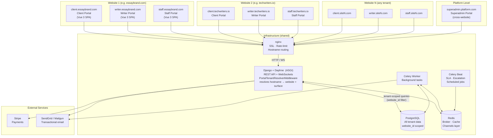
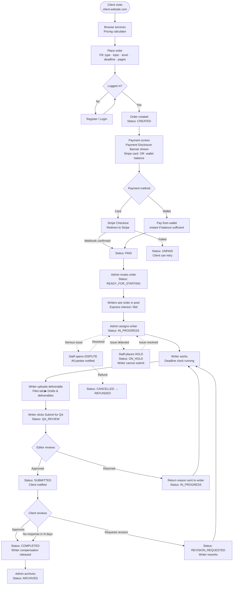
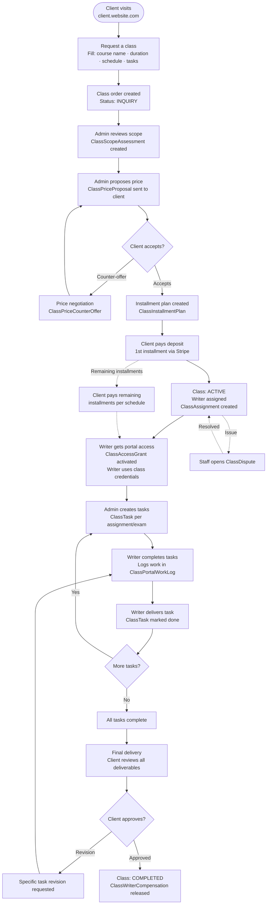
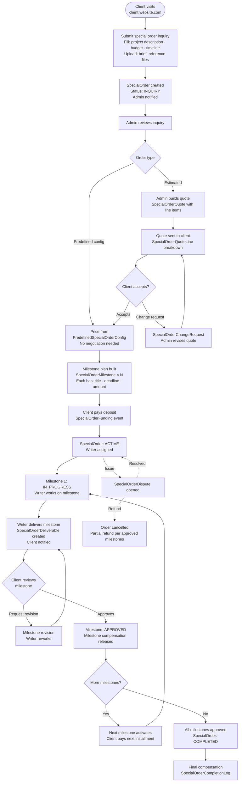
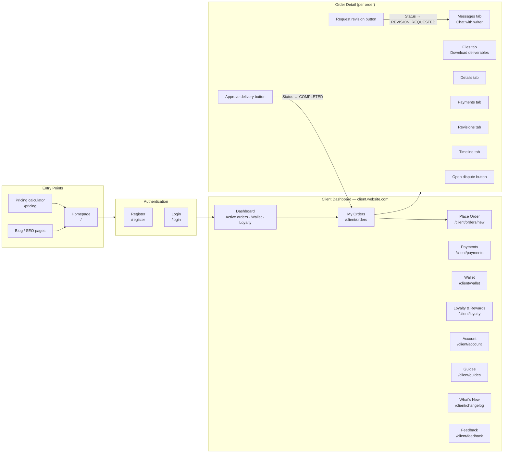
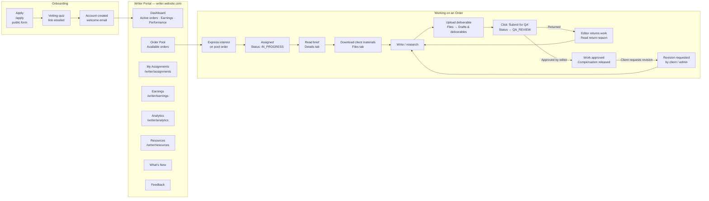
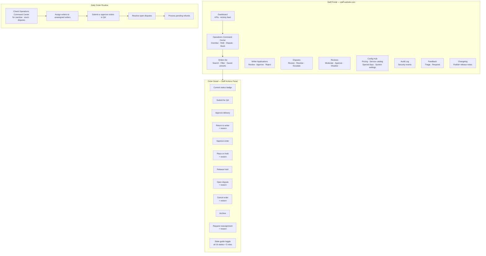
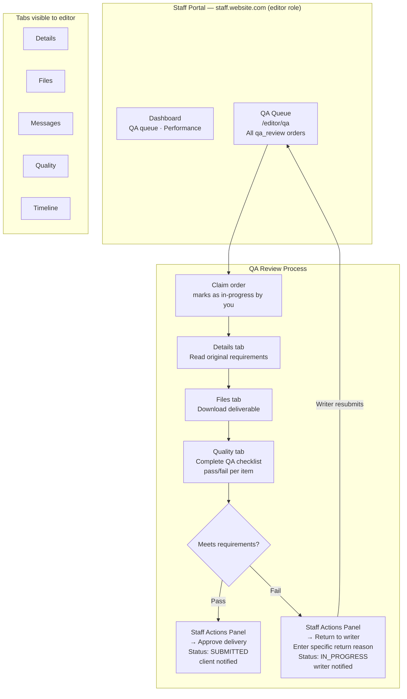
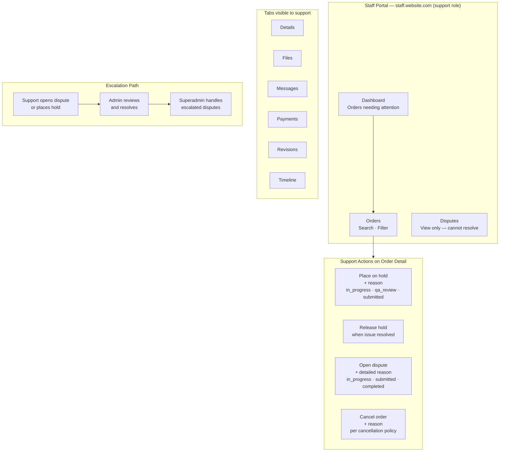
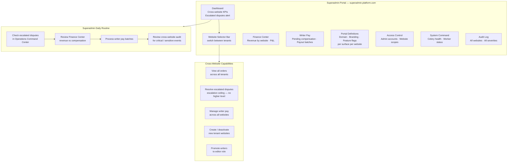

# Platform Flow Diagrams

All diagrams use [Mermaid](https://mermaid.js.org/) and render natively on GitHub, GitLab, and most modern doc platforms.

---

## Table of Contents

1. [Multi-Tenant Domain Architecture](#1-multi-tenant-domain-architecture)
2. [Standard Order — End-to-End Flow](#2-standard-order--end-to-end-flow)
3. [Express Class — End-to-End Flow](#3-express-class--end-to-end-flow)
4. [Special Order — End-to-End Flow](#4-special-order--end-to-end-flow)
5. [Client Workflow](#5-client-workflow)
6. [Writer Workflow](#6-writer-workflow)
7. [Admin Workflow](#7-admin-workflow)
8. [Editor (QA) Workflow](#8-editor-qa-workflow)
9. [Support Workflow](#9-support-workflow)
10. [Superadmin Workflow](#10-superadmin-workflow)

---

## 1. Multi-Tenant Domain Architecture

Each website is an independent tenant. Every tenant gets up to three portal surfaces on separate domains — client, writer, and staff. All surfaces route through nginx to the same Django backend, which uses the hostname to resolve the portal context and enforce access rules.

### Portal surface access rules

| Domain resolves to | Role required | Sees data for |
|---|---|---|
| client.* | `client` | Own orders only |
| writer.* | `writer` | Assigned orders + pool |
| staff.* | `admin`, `support`, `editor` | All data on that website |
| superadmin.* | `superadmin` | All websites |

---

## 2. Standard Order — End-to-End Flow

---

## 3. Express Class — End-to-End Flow

A class is a time-bound engagement where a writer handles coursework, assignments, or exam sittings on behalf of a client. It uses a separate `ClassOrder` model with tasks, installment payments, and portal access grants.

---

## 4. Special Order — End-to-End Flow

A special order is a custom project (e.g. a book, research report, long-form content series) with a quote-based price and milestone-based delivery. Uses `SpecialOrder` model with `SpecialOrderMilestone` records.

---

## 5. Client Workflow

---

## 6. Writer Workflow

---

## 7. Admin Workflow

---

## 8. Editor (QA) Workflow

---

## 9. Support Workflow

---

## 10. Superadmin Workflow

---

## Order Type Comparison

| Dimension | Standard Order | Express Class | Special Order |
|---|---|---|---|
| **What it is** | One document or set of files | Ongoing coursework / exam sittings | Custom multi-milestone project |
| **Pricing** | Fixed (from service catalog) | Negotiated per scope | Quote-based or predefined config |
| **Delivery** | Single file | Per task/session | Per milestone |
| **Payment** | Full upfront (card or wallet) | Installment plan | Deposit + milestone payments |
| **Writer access** | Order files only | Portal access grant (ClassAccessGrant) | Order files + milestone deliverables |
| **Client approval** | Single approval at submission | Per task + final | Per milestone + final |
| **QA** | Editor reviews before delivery | Admin grades tasks | Admin reviews milestones |
| **Dispute model** | `OrderDispute` | `ClassDispute` (via class_management) | `SpecialOrderDispute` |
| **Backend app** | `orders` | `class_management` | `special_orders` |
| **Admin view** | `/admin/orders` | `/admin/classes` | `/admin/special-orders` |
